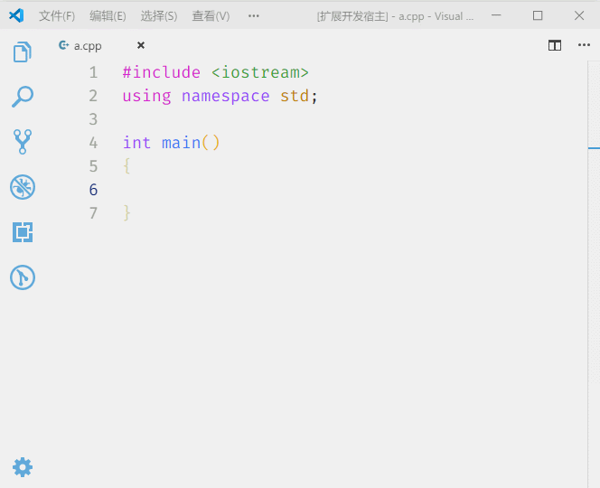

# lazykey README

A special plugin for lazy people by using the fewest keystrokes in the normal syntax of C/C++/Java/JS.

## Features

LazyKey redefines the following keys:

- `space`
- `comma`
- `simicolon`
- `dot`
- `left square bracket`
- `right square bracket`
- `minus`
- `equal`
- `zero`
- `nine`
- `less`

### space key

- Add ` ()` after `if` / `for` / `while` / `foreach` / `switch` by pressing space key
  for example, convert `if|` to `if (|)`. (`|` is the current cursor)

### comma key

- Add space character if this comma is inside the parentheses
- Convert `,,` to `<<` with appropriate spaces

### semicolon key

- Automatically add `;` to the line end, unless the line ends with a comment
- Insert next line after an exists `;`
- Insert next line if the current line already contains a `;`
- Ignore `for ( ; ; )`

### dot key

- Convert `.` to `->` of C++ `class` and `point` objects
- Convert between `.` and `->` in any case

### left square bracket

- Convert `[` to `{ }` and automatically jump to the next line if the current line is missing a code block
- Jump into the code block after `if` / `for` / `while` / `foreach` / `switch` if already exists `{ }`
- Add next line into a code block according to the above two behaviors if posible
- Convert `[]` to `{ }` and automatically break lines in a blank line
- Jump out of `]` or `}`
- Support both Lambda brackets, `[]` and `{}`

### right square bracket

- Jump out of `]` or `}` after the cursor
- Jump out of `}` in following line, and add one line if necessary
- Add another one line after `}`

### minus key

- Convert `-` to `_` where the variable is declared
- Convert `-` to `_` if exists such variable
- Automatically add spaces, such as `a-` to `a - `
- It doesn't affect variable decrement, like `a--`

### equal key

- Automatically add spaces, such as `a=` to `a = `, `a+=` to `a += `
- It doesn't affect multiple equal
- Convert `1=` to `!=` with appropriate spaces

### number nine key

- Convert `9` to `(` in the appropriate place

### number zero key

- Convert `0` to `)` in the appropriate place

### less key

- Automatically add spaces at left and right

## Extension Settings

You can decide the switch for each function.

This extension contributes the following settings:

## Known Issues

It may change your button habits and make you lazy.

## Release Notes

### 1.0.0

Add some key mapping.

-----------------------------------------------------------------------------------------------------------

### For more information

* [GitHub](https://github.com/MRXY001/vscode-plugin-LazyKey/)

**Enjoy!**
